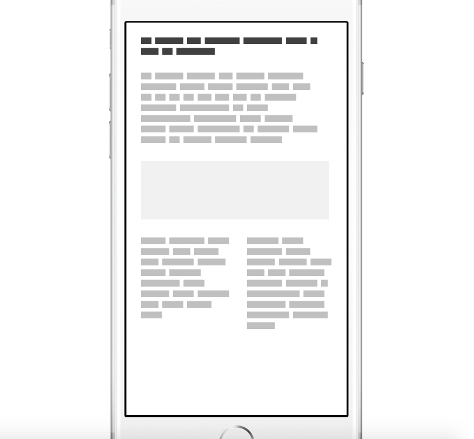

## LoremIpsumBlocks Module for FramerJS

Wireframe style lorem ipsum for your prototype



#### Usage:
Place `LoremIpsumBlocks.coffee` into the `modules` folder of your project.


``` coffeescript
{Blocks} = require "LoremIpsumBlocks"

# ...

paragraphA = new Blocks
	x: 50, y: 50
	width: 600
	wordCount: 40
```

<a href="#"></a>

#### Options:

``` coffeescript
# Options:       Default Value
# ----------------------------
# wordCount:     24
# wordSpacing:   12
# letterHeight:  24
# letterWidth:   12
# lineSpacing:   12
# color:         "silver"
```